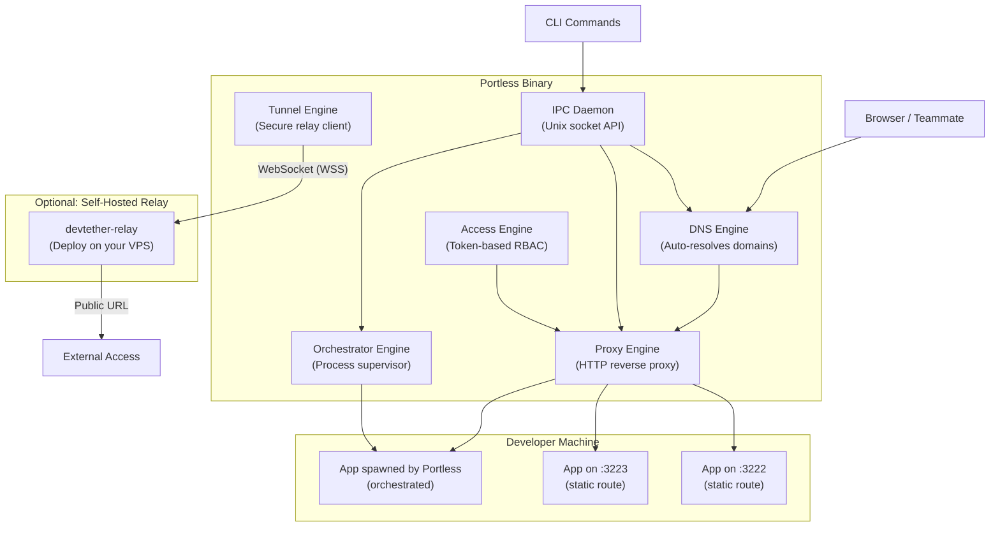

# Architecture Overview

> *Version 2.0 — Revised 2026-05-30*

This document provides a deep dive into the architecture of **Portless**. If you're contributing to or hacking on the codebase, this is the best place to start.

---

## High-Level Architecture

Portless is built as **4 independent engines** that coexist inside a single Go binary. Each engine solves a distinct networking problem. Two shared infrastructure layers (DNS + Proxy) underpin all engines.



### Request Flow (Static Routing)

```
1. Browser requests http://portfolio.localhost
2. OS DNS resolver forwards *.localhost to Portless DNS (127.0.0.1:53)
3. Portless DNS returns 127.0.0.1 (or LAN IP in --lan mode)
4. Browser connects to Portless Proxy on port 80 (or 8080 fallback)
5. Proxy inspects Host header → looks up "portfolio.localhost" in Router
6. Router returns Target{Port: 3222, URL: http://127.0.0.1:3222}
7. Proxy forwards request to backend, returns response to browser
```

### Request Flow (Orchestrated)

```
1-4. Same as static routing
5. Proxy inspects Host header → looks up "api.localhost" in Router
6. Router returns Target{Port: 43521, URL: http://127.0.0.1:43521}
   (port was dynamically allocated by PortManager and injected as $PORT)
7. Proxy forwards to the process spawned by the Supervisor
```

---

## Shared Infrastructure

### DNS Engine (`internal/dns`)

The DNS engine intercepts UDP queries on port 53 for configured TLDs and resolves them locally.

**Behavior:**
- Default bind: `127.0.0.1:53` (loopback only)
- LAN mode bind: `0.0.0.0:53` (all interfaces)
- Responds to A record queries for configured TLDs (`.localhost`, `.local`, `.test`)
- Returns `127.0.0.1` in solo mode, or the host's LAN IP in `--lan` mode
- All non-matching queries receive `NXDOMAIN` — Portless never forwards upstream
- LAN IP is cached on startup and refreshed on network changes (not per-query)

**Key design decision:** Portless is NOT a recursive DNS resolver. It only answers queries for its own configured domains. See [ADR-002](adr/002-dns-design.md).

### Proxy Engine (`internal/proxy`)

The HTTP reverse proxy is the primary data plane for all engines.

**Behavior:**
- Default bind: `:80` (fallback `:8080` without `cap_net_bind_service`)
- Uses `http.Server{}` with explicit timeouts (`ReadTimeout`, `WriteTimeout`, `IdleTimeout`)
- Supports `Connection: Upgrade` for WebSocket pass-through (HMR, live reload)
- Strips and re-sets `X-Forwarded-*` headers to prevent injection
- Enforces loopback-only targets — routes can only point to `127.0.0.1:<port>`
- Graceful shutdown via `http.Server.Shutdown(ctx)` with a 5-second drain period

**Middleware chain:**
```
Incoming Request
  → Host Header Validation (exact match against route table)
  → Access Token Validation (if RBAC enabled for this route)
  → X-Forwarded-* Sanitization
  → httputil.ReverseProxy.ServeHTTP()
```

### Router (`internal/router`)

The Router is a thread-safe, in-memory map of `domain → Target` structs.

```go
type Target struct {
    ServiceName string
    Port        int
    URL         *url.URL
}
```

- Protected by `sync.RWMutex` for concurrent read/write safety
- Shared by both static routes and orchestrated services
- Hot-reloadable via the IPC daemon (no restart needed)

### IPC Daemon (`internal/daemon`)

Exposes a RESTful API over a Unix domain socket for CLI ↔ daemon communication.

**Socket location:** `$XDG_RUNTIME_DIR/devtether/devtether.sock` (fallback: `/tmp/devtether.sock`)
**Permissions:** `0600` (owner-only read/write)

**Endpoints:**
| Method | Path | Purpose |
|--------|------|---------|
| `GET` | `/services` | List all active routes and services |
| `POST` | `/services` | Add a route or orchestrated service |
| `DELETE` | `/services?domain=X` | Remove a route or stop a service |
| `GET` | `/status` | Health check + engine status |

---

## Engine 1: Static Routing

**Config section:** `routes:`

No process management. The Router is populated directly from the YAML config with fixed `domain → port` mappings. The developer starts their own apps.

---

## Engine 2: Process Orchestrator (`internal/orchestrator`)

**Config section:** `orchestrate:`

### Supervisor

- Spawns processes via `exec.Command("sh", "-c", command)`
- Sets `SysProcAttr{Setpgid: true}` for process group management
- Injects `PORT=<allocated_port>` into the command's environment
- Captures stdout/stderr with `[service-name]` prefixes
- Monitors process exit in a background goroutine, cleans up route + port on crash

### Port Manager

- Allocates ephemeral ports via `net.ListenTCP("127.0.0.1:0")`
- Maintains an internal dedup map to prevent double-allocation
- Releases ports when services are stopped or crash

### Shutdown Sequence

```
1. Send SIGTERM to process group (-PID)
2. Wait 5 seconds
3. If still alive, send SIGKILL to process group
4. Remove route from Router
5. Release port in PortManager
```

---

## Engine 3: Tunnel (`internal/tunnel`)

**Config section:** `tunnel:`

### LAN Mode

- Switches proxy bind to `0.0.0.0`
- Broadcasts service names via mDNS (`avahi-publish-address` on Linux, `dns-sd` on macOS)
- Auto-detects and follows LAN IP changes

### WAN Mode

- Establishes outbound WebSocket (WSS) connection to `devtether-relay`
- Single connection multiplexes all service tunnels via a lightweight framing protocol
- Relay performs TLS termination with auto-provisioned Let's Encrypt certificates
- Relay routes incoming HTTPS requests by inspecting the `Host` header subdomain

### Relay Binary (`cmd/devtether-relay`)

Separate build target in the same repository. Deployed on a VPS.

- Accepts tunnel registrations from authenticated clients
- Issues and validates per-developer registration tokens scoped to subdomain patterns
- Enforces rate limits per tunnel
- Logs all requests in structured JSON

---

## Engine 4: Access Control (`internal/access`)

**Config section:** `access:`

- Generates HMAC-SHA256 signed JWTs with: issuer, scoped services (glob patterns), expiry, revocation ID
- Proxy middleware validates tokens on incoming requests before forwarding
- Token store: local SQLite database or flat file
- WAN tunnels force RBAC on by default

---

## Codebase Structure

```
devtether/
├── cmd/
│   ├── devtether/               # Main CLI binary
│   │   └── main.go
│   └── devtether-relay/         # Relay server binary
│       └── main.go
│
├── internal/
│   ├── cli/                    # Cobra command definitions
│   ├── config/                 # YAML config parsing + validation
│   ├── dns/                    # DNS Engine
│   ├── proxy/                  # Proxy Engine (server + handler + middleware)
│   ├── router/                 # Route table (domain → target)
│   ├── orchestrator/           # Process Supervisor + Port Manager
│   ├── tunnel/                 # Tunnel client + LAN broadcaster
│   ├── access/                 # Token generation + validation + store
│   └── daemon/                 # IPC Unix socket server + client
│
├── docs/
│   ├── PRD.md                  # Product Requirements Document
│   ├── architecture.md         # This file
│   └── adr/                    # Architectural Decision Records
│
├── devtether.yaml               # Example config
├── go.mod
├── go.sum
├── LICENSE
└── README.md
```

---

## Lifecycle Management

### Startup (`devtether up`)

```
1. Load devtether.yaml
2. Initialize Router (empty)
3. Populate Router from `routes:` section (static)
4. Start DNS Engine (goroutine)
5. Start Proxy Engine (goroutine, with http.Server)
6. Start IPC Daemon (goroutine)
7. If `orchestrate:` section exists:
   a. For each service: allocate port → add route → spawn process
8. If `--lan`: switch to 0.0.0.0 binding, start mDNS broadcast
9. If `--tunnel`: connect to relay via WebSocket
10. Block on signal handler (SIGINT/SIGTERM)
```

### Shutdown (`Ctrl+C` or `devtether down`)

```
1. Receive SIGINT/SIGTERM
2. Stop accepting new proxy connections
3. Drain in-flight proxy requests (5s timeout)
4. SIGTERM all orchestrated processes (5s timeout → SIGKILL)
5. Shutdown DNS server
6. Close IPC socket, remove socket file
7. Disconnect tunnel (if active)
8. Exit cleanly
```

---

*This architecture document is a living reference. It will be updated as engines are implemented across the project's phases.*
