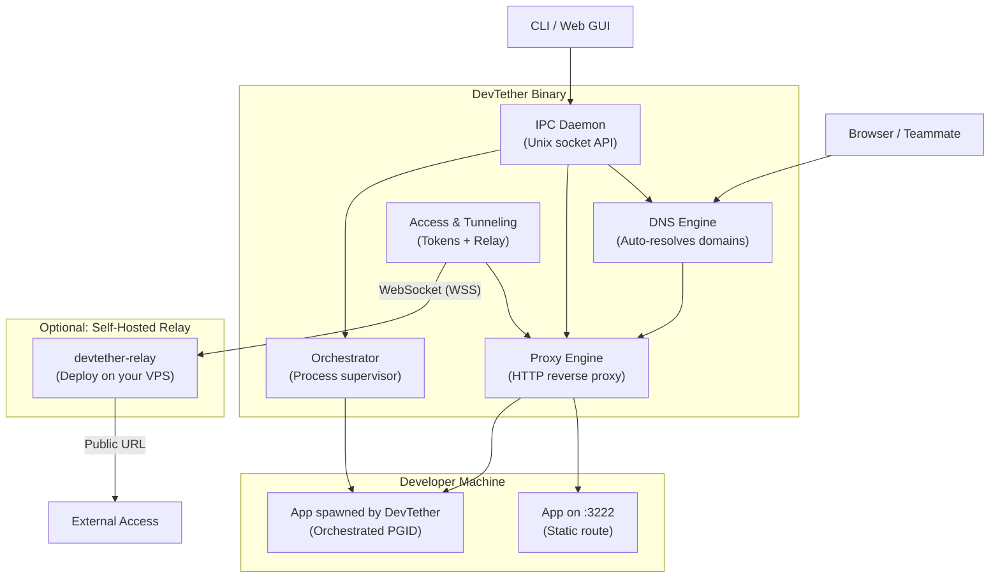

# Architecture Overview

> *Version 2.0-beta — Revised 2026-05-30*
> 
> **Project Status: Beta** — Engine 1 (Local Static Routing) is fully implemented and provides a stable foundation for the project. The rest of Layer 1 (Cross-device tunnels) and Layers 2-3 are planned for future stages.

This document provides a deep dive into the architecture of **DevTether**. If you're contributing to or hacking on the codebase, this is the best place to start.

> **Code standards:** See [Engineering Standards](engineering-standards.md) for
> DRY, SoC, error handling, and testing rules that apply to all packages below.

---

## High-Level Architecture

DevTether is evolving from a simple reverse proxy into a comprehensive Developer Platform. To maintain strict Separation of Concerns (SoC) and avoid architectural bloat, all features are conceptually structured into **Three Main Layers**. Internally, these layers are powered by **4 independent modular engines** (see [ADR-001](adr/001-modular-engine-architecture.md)) inside a single Go binary. Two shared infrastructure layers (DNS + Proxy) underpin all higher-level features.



### The Unified Interface (CLI & GUI)
DevTether operates on a **Unified Interface** principle. The Web GUI (`devtether.localhost`) is completely stateless and lazy-loaded (it is NOT a heavy background process). Both the CLI (e.g., `devtether stop api`) and the Web GUI call the exact same internal **IPC Daemon REST API**. This guarantees zero DRY violations — whatever is possible in the GUI is equally possible via the CLI.

---

## Shared Infrastructure

### DNS Engine (`internal/dns`)

The DNS engine intercepts UDP queries on port 53 for configured TLDs and resolves them locally.

**Behavior:**
- Default bind: `127.0.0.1:53` (loopback only)
- Fallback chain: `53` → `5353` → `Non-Fatal Error` (proxy still works without DNS)
- LAN mode bind: `0.0.0.0:53` (all interfaces)
- Responds to A record queries for configured TLDs (`.localhost`, `.internal`, `.test`)
- Returns `127.0.0.1` in solo mode, or the host's LAN IP in `--lan` mode
- All non-matching queries receive `NXDOMAIN` — DevTether never forwards upstream
- LAN IP is cached on startup and refreshed on network changes (not per-query)

**Key design decision:** DevTether is NOT a recursive DNS resolver. It only answers queries for its own configured domains. See [ADR-002](adr/002-dns-design.md).

### Proxy Engine (`internal/proxy`)

The HTTP reverse proxy is the primary data plane for all engines.

**Behavior:**
- Default bind: `127.0.0.1:80`
- Fallback chain: `127.0.0.1:80` → `127.0.0.1:8080` → `127.0.0.1:0` (OS-assigned port) on `EACCES` or `EADDRINUSE`
- Uses `http.Server{}` with `ReadHeaderTimeout` (Slowloris protection) and `IdleTimeout` (dead connection pruning). Absolute read/write timeouts are intentionally omitted to support WebSocket, SSE, and streaming workloads (see ADR-008).
- Supports `Connection: Upgrade` for WebSocket pass-through (HMR, live reload)
- Strips and re-sets `X-Forwarded-*` headers to prevent injection
- Enforces loopback-only targets — routes can only point to `127.0.0.1:<port>`
- Graceful shutdown via `http.Server.Shutdown(ctx)` with a 5-second drain period

**Middleware chain:**
```
Incoming Request
  → Host Header Validation (exact match against route table)
  → Access Token Validation (if RBAC enabled for this route)
  → X-Forwarded-* Sanitization
  → httputil.ReverseProxy.ServeHTTP()
```

### Router (`internal/router`)

The Router is a thread-safe, in-memory map of `domain → Target` structs.

```go
type Target struct {
    ServiceName string
    Port        int
    URL         *url.URL
    Type        RouteType
}
```

- Protected by `sync.RWMutex` for concurrent read/write safety
- Shared by both static routes and orchestrated services
- Hot-reloadable via the IPC daemon (no restart needed)

### IPC Daemon (`internal/daemon`)

Exposes a RESTful API over a Unix domain socket for CLI ↔ daemon communication.

**Socket location:** `$XDG_RUNTIME_DIR/devtether/devtether.sock` (fallback: `/tmp/devtether.sock`)
**Permissions:** `0600` (owner-only read/write)

**Endpoints:**
| Method | Path | Purpose |
|--------|------|---------|
| `GET` | `/routes` | List all active routes |
| `POST` | `/services` | **[Planned]** Add a route or orchestrated service |
| `DELETE` | `/services?domain=X` | **[Planned]** Remove a route or stop a service |
| `GET` | `/status` | **[Planned]** Health check + engine status |

---

## Layer 1: The Networking Layer

This layer handles all traffic, routing, and local network topologies.

**Config section:** `routes:`

- **Static Routing:** Maps pre-existing services on fixed ports to named domains. No process management. The Router is populated directly from the YAML config.
- **[Planned] Intelligent IP Cycling:** Actively scans `/proc/net/tcp` for `0.0.0.0` bindings. If `127.0.0.1:80` is occupied, it cycles to `127.0.0.2`, `127.0.0.3`, etc., using highly optimized O(1) checks.
- **[Planned] Smart CORS:** Automatically injects CORS headers for intra-project traffic (e.g., `portfolio.localhost` to `api.portfolio.localhost`) while blocking cross-project local access.
- **[Planned] Traffic Inspection:** Buffers payloads via `sync.Pool` (zero-bloat) and streams them via IPC for 1-click webhook replays.
- **Rich Error Pages:** Serves an ultra-lightweight HTML error page if a backend goes down.

---

## Layer 2: The Process Orchestrator Layer (`internal/orchestrator`)

**Config section:** `orchestrate:`

### Supervisor
- Spawns processes via `exec.Command("sh", "-c", command)`
- Sets `SysProcAttr{Setpgid: true}` for **Process Group** management.
- Injects `PORT=<allocated_port>` into the command's environment.
- Captures stdout/stderr with `[service-name]` prefixes for **Unified Logging**.
- Monitors process exit in a background goroutine, cleans up route + port on crash.

### Port Manager
- Allocates ephemeral ports via `net.ListenTCP("127.0.0.1:0")`.
- Maintains an internal dedup map to prevent double-allocation.
- Releases ports when services are stopped or crash.

### Shutdown Sequence
```
1. Send SIGTERM to process group (-PID)
2. Wait 5 seconds
3. If still alive, send SIGKILL to process group
4. Remove route from Router
5. Release port in PortManager
```

---

## Layer 3: The Access Controls Layer (`internal/access` & `internal/tunnel`)

**Config sections:** `tunnel:` and `access:`

This layer secures cross-network and cross-org collaboration.

### LAN Sharing & mDNS
- Switches proxy bind to `0.0.0.0`.
- Broadcasts service names via mDNS (`avahi-publish-address` on Linux, `dns-sd` on macOS).

### WAN Tunneling (Self-Hosted Relay)
- Establishes outbound WebSocket (WSS) connection to a self-hosted `devtether-relay`.
- The relay performs TLS termination with auto-provisioned Let's Encrypt certificates.

### Centralized RBAC & IAM
- Generates HMAC-SHA256 signed JWTs with scoped services (glob patterns).
- Proxy middleware validates tokens on incoming requests before forwarding.
- WAN tunnels force RBAC on by default — no opt-out.

---

## Codebase Structure

```
devtether/
├── cmd/
│   └── devtether/               # Main CLI binary
│       └── main.go
│
├── internal/
│   ├── cli/                    # Cobra command definitions
│   ├── config/                 # YAML config parsing + validation
│   ├── daemon/                 # IPC Unix socket server + client
│   ├── dns/                    # DNS Engine
│   ├── proxy/                  # Proxy Engine (server + handler)
│   └── router/                 # Route table (domain → target)
│
├── docs/
│   ├── PRD.md                  # Product Requirements Document
│   ├── architecture.md         # This file
│   └── adr/                    # Architectural Decision Records
│
├── examples/                    # Example config files
├── devtether.yaml               # Local config (gitignored)
├── go.mod
├── go.sum
├── LICENSE
└── README.md
```

### Planned Directories (Future Stages)

```
│   ├── internal/orchestrator/   # Process Supervisor + Port Manager (Layer 2)
│   ├── internal/tunnel/         # Tunnel client + LAN broadcaster (Layer 3)
│   ├── internal/access/         # Token generation + validation (Layer 3)
│   └── cmd/devtether-relay/     # Relay server binary (Layer 3)
```

---

## Developer Experience (DX) Architecture

### The Stateless Web GUI (`devtether.localhost`)
The Web GUI is an ultra-lightweight (Vanilla JS / Preact) dashboard served internally via the Proxy Engine.
- **Zero State:** It acts strictly as a visual editor for `devtether.yaml` and a consumer of the IPC Daemon's REST API.
- **Hot Reloading:** When a user clicks "Add Service" in the GUI, it updates the YAML file via the IPC API, triggering the exact same hot-reload flow as if they edited the file via CLI.
- **Network Inspector:** Buffers requests using `sync.Pool` (adhering to zero-bloat engineering standards) and streams them over the IPC socket for webhook inspection and replay.

### Unified Logging Architecture
As DevTether orchestrates multiple processes, it streams logs via the IPC daemon using strict service prefixes:
- `[proxy | portfolio]` for network access logs (Layer 1).
- `[app   | api]` for `stdout`/`stderr` from orchestrated processes (Layer 2).
- The CLI supports Docker-style streaming: `devtether logs -f <service> --type=network`.

### Granular Service Management
The command `devtether stop <service>` instructs the IPC Daemon to coordinate across layers:
1. **Layer 1 (Networking):** Disables the static route.
2. **Layer 2 (Orchestration):** Sends `SIGTERM` to the process tree and releases the ephemeral port.
3. **Layer 3 (Access/Tunnel):** Unregisters the service from the WAN relay and stops mDNS broadcast.

---

## Lifecycle Management

### Startup (`devtether up`)

```
1. Load devtether.yaml
2. Initialize Router (empty)
3. Populate Router from `routes:` section (static)
4. Start DNS Engine (goroutine)
5. Start Proxy Engine (goroutine, with http.Server)
6. Start IPC Daemon (goroutine)
7. If `orchestrate:` section exists:
   a. For each service: allocate port → add route → spawn process
8. If `--lan`: switch to 0.0.0.0 binding, start mDNS broadcast
9. If `--tunnel`: connect to relay via WebSocket
10. Block on signal handler (SIGINT/SIGTERM)
```

### Shutdown (`Ctrl+C` or `devtether down`)

```
1. Receive SIGINT/SIGTERM
2. Stop accepting new proxy connections
3. Drain in-flight proxy requests (5s timeout)
4. SIGTERM all orchestrated processes (5s timeout → SIGKILL)
5. Shutdown DNS server
6. Close IPC socket, remove socket file
7. Disconnect tunnel (if active)
8. Exit cleanly
```

---

*This architecture document is a living reference. It will be updated as layers are implemented across the project's stages.*
