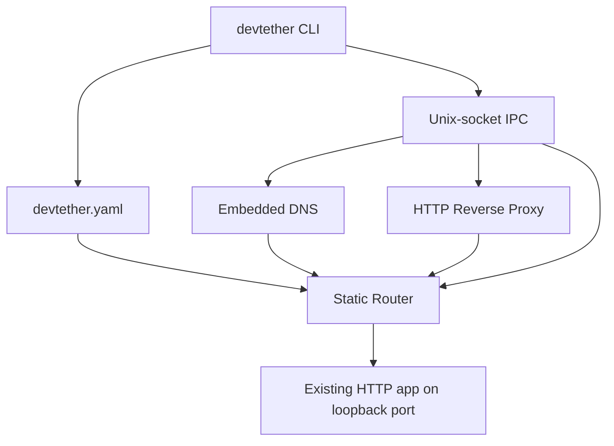

# Architecture Overview

> **Current release:** v2.0.0-beta.7
>
> **Current implementation:** Engine 1 — Local Static Routing
>
> This document separates the architecture that exists today from the target architecture that may be implemented later.

## 1. Current Beta Architecture

DevTether beta.7 is a single Go binary containing the CLI, daemon lifecycle, embedded DNS server, HTTP reverse proxy, router, configuration loader, logger, and supporting utilities.

There is no current Web GUI, process orchestrator, LAN/WAN tunnel engine, access-control engine, or OS service-install module in the develop tree.

### Current component flow


```mermaid
graph TB
    CLI["devtether CLI"] --> IPC["Unix-socket IPC"]
    CLI --> CFG["devtether.yaml"]
    CFG --> ROUTER["Static Router"]
    DNS["Embedded DNS"] --> ROUTER
    PROXY["HTTP Reverse Proxy"] --> ROUTER
    ROUTER --> APP1["Existing HTTP app on loopback port"]
    IPC --> ROUTER
    IPC --> DNS
    IPC --> PROXY
```

## 2. Current Configuration Contract

The current beta accepts:

```yaml
routes:
  web.localhost: 3222
  api.localhost: 8042

settings:
  daemon: false
  verbose: false
  log_path: "./.logs"

proxy:
  port: 80
  timeouts:
    idle: 120s

dns:
  bind: "127.0.0.1:5335"
```

Unknown YAML fields are rejected by strict decoding.

The config types contain future `orchestrate:`, `tunnel:`, and `access:` structures for long-term schema design, but current validation rejects those sections because the corresponding engines are not implemented.

## 3. Current DNS Engine

Package: `internal/dns`

The DNS server is embedded in the main binary.

### Contract

- Default bind: `127.0.0.1:5335`.
- Managed namespace: `.localhost`.
- No upstream forwarding.
- Only routes that exist in the router are managed.
- A record for a managed route returns `127.0.0.1`.
- An existing route queried with an unsupported type such as AAAA or HTTPS returns NOERROR with zero answers (NODATA).
- An unknown route returns NXDOMAIN.
- Network-boundary handler panic recovery is enabled.

`.internal` is not a current namespace.

### Host integration

`devtether init` can configure supported host resolvers with explicit user consent. The resolver configuration receives the exact DNS port used by the generated configuration. The safe default is `5335`.

If `dns.bind` is manually changed, the host resolver must be updated to match.

## 4. Current Proxy Engine

Package: `internal/proxy`

The current data plane is an HTTP reverse proxy.

### Bind behavior

1. Try the configured proxy port, default `127.0.0.1:80`.
2. If permission is denied or the address is already in use, try `127.0.0.1:8080`.
3. If the fallback also fails, startup fails.
4. There is no random or OS-assigned `:0` fallback.

Both configured and fallback listeners remain loopback-only.

### Request behavior

```text
HTTP request
  → normalize Host
  → exact route lookup
  → inject resolved Target into context
  → sanitize forwarding headers
  → httputil.ReverseProxy
  → loopback backend
```

The proxy supports WebSocket upgrades and streaming workloads. Fixed `ReadTimeout`/`WriteTimeout` values are intentionally omitted per ADR-008; `ReadHeaderTimeout` and `IdleTimeout` remain enforced.

The proxy keeps a bounded error-log throttle cache. It stores cooldown timestamps and uses random map eviction when its capacity limit is reached; it is not an LRU/TTL cache.

## 5. Current Router

Package: `internal/router`

The router is a thread-safe in-memory map of normalized domain names to route targets.

- Routes are loaded from `routes:` at startup.
- Route output is sorted where exposed by current CLI/API surfaces.
- Configuration changes are not hot-reloaded.
- Changing routes currently requires `devtether down && devtether up`.

## 6. Current IPC Daemon

Package: `internal/daemon`

The CLI communicates with the daemon over an HTTP API carried by a Unix-domain socket.

Current endpoints:

| Method | Path | Purpose |
|---|---|---|
| GET | `/routes` | List active routes |
| GET | `/status` | Report PID, uptime, route count, heap and config path |
| POST | `/shutdown` | Request graceful shutdown using the daemon nonce |

The current API does not support dynamic configuration writes.

### Instance and state ownership

- Runtime directories are per-user and validated before mutation.
- Instance ownership uses an exclusive `flock`.
- PID state is secondary diagnostic/fallback state.
- Shutdown requests use a startup nonce.
- Unix sockets are owner-only.
- Detached startup uses an anonymous readiness pipe so the parent can distinguish a successful child bind from an early startup failure.

### Liveness waiting

`WaitForExit` probes the daemon lock with a non-blocking `flock` every **500 ms** until the lock is released or the caller's context is cancelled. A future event-driven alternative remains deferred.

## 7. Current CLI Surface

| Command | Current behavior |
|---|---|
| `init` | Generate config; optionally configure resolver and Linux setcap |
| `up` / `start` | Start the routing daemon |
| `down` / `stop` | Gracefully stop the daemon |
| `status` | Show daemon state |
| `routes` | Show active routes |
| `logs` | Show detached daemon logs |
| `doctor` | Diagnose environment/configuration issues |
| `version` | Show build information |

Detached logs use the configured log directory. When `settings.log_path` is omitted, the default is `.logs/devtether.log` relative to the config file.

## 8. Current Initialization Flow

`devtether init` is an explicit local integration command.

On supported systems it may:

1. create a valid `devtether.yaml`;
2. optionally apply Linux `setcap` for privileged proxy binding;
3. detect supported DNS resolver integration;
4. ask whether the user wants system resolver changes;
5. write the DNS port into the generated resolver configuration.

System mutations require explicit user consent. Unsupported resolver setups are reported instead of silently changed.

## 9. Current Health Reporting

The startup summary prints configured routes and currently starts a lightweight route health-check loop that probes backend ports every 3 seconds while the daemon is running.

This health-check behavior is current but is intentionally considered a candidate for future replacement with on-demand `devtether routes` checks. It must not be described as a zero-polling daemon feature.

## 10. Target Architecture — Future Engines

The target architecture contains four independent engines:

### Engine 1 — Local Static Routing

Current foundation:
- DNS;
- HTTP proxy;
- static router;
- daemon/IPC lifecycle.

### Engine 2 — Orchestration

Future:
- process groups;
- process lifecycle supervision;
- dynamic `$PORT` allocation;
- unified process logs.

### Engine 3 — Tunneling

Future:
- LAN sharing;
- WAN tunnels;
- self-hosted relay;
- optional `devtether-relay` binary.

### Engine 4 — Access Control

Future:
- scoped access tokens;
- RBAC;
- service policy enforcement for shared/tunneled services.

The current beta intentionally rejects configuration for these future engines.

## 11. Future Web GUI / Traffic Inspection

A future GUI is proposed only after the IPC/config-management model is expanded.

The deferred design proposes:
- a lightweight UI served at `devtether.localhost`;
- embedded static assets;
- strict browser Origin/Host validation;
- richer `/api/*` management endpoints;
- traffic inspection/replay.

These are future proposals, not current beta capabilities.

## 12. Future OS Service Management

System-level `systemd`/launchd` integration is future/deferred work. It is not part of the current command surface or source tree.

## 13. Current Codebase Structure

```text
devtether/
├── cmd/
│   └── devtether/
├── internal/
│   ├── cli/
│   ├── config/
│   ├── daemon/
│   ├── dns/
│   ├── logger/
│   ├── netutil/
│   ├── proxy/
│   └── router/
├── docs/
├── scripts/
├── go.mod
└── README.md
```

Future packages such as `internal/orchestrator`, `internal/tunnel`, `internal/access`, and `cmd/devtether-relay/` are not present in the current source tree.

## 14. Lifecycle

### Startup

```text
1. Load and validate devtether.yaml
2. Apply explicit foreground/detached mode rules
3. Check for an existing daemon before binding listeners
4. Load static routes
5. Create DNS, proxy and IPC server objects
6. Bind DNS
7. Bind proxy
8. Bind IPC
9. Start serving goroutines
10. In detached mode, send readiness through the anonymous pipe
11. Render startup state and run the current route health check loop
```

### Shutdown

```text
1. Receive SIGINT/SIGTERM or IPC shutdown request
2. Stop accepting new proxy work
3. Drain active proxy connections for up to 5 seconds
4. Shut down DNS and IPC
5. Release runtime ownership and clean transient state
6. Exit
```

Graceful streaming behavior is governed by ADR-008 and the implementation in the proxy/daemon lifecycle packages.

*Future architecture must remain clearly separated from the current beta contract.*
